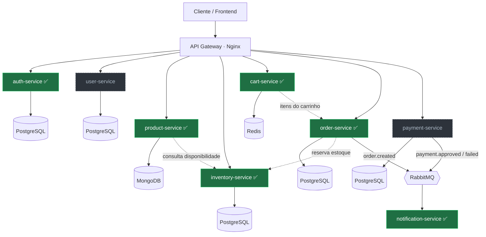
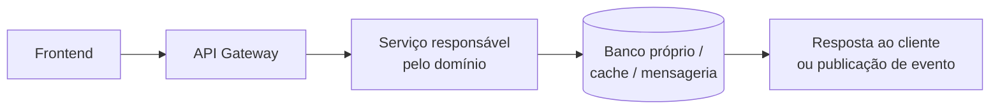
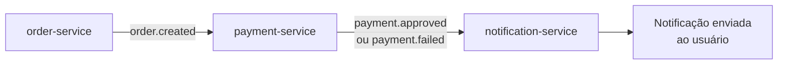

# E-Commerce Platform

Plataforma de e-commerce completa construída com arquitetura de microserviços, criada como projeto educacional de portfólio para praticar desenvolvimento de software de ponta a ponta.

O objetivo do projeto é simular uma aplicação real de comércio eletrônico, separando os principais domínios do negócio em serviços independentes, cada um com responsabilidades, banco de dados e fluxo de comunicação próprios.

> **Status:** projeto em desenvolvimento ativo. Fases 1 a 4 concluídas, além do serviço de notificações (Fase 6) — a fundação, autenticação, o núcleo comercial (catálogo + estoque), o carrinho, os pedidos e as notificações assíncronas já estão implementados. Este README separa o que já foi construído do que será implementado nas próximas fases.

---

## Sumário

- [Visão geral](#visão-geral)
- [Objetivos de aprendizado](#objetivos-de-aprendizado)
- [Arquitetura](#arquitetura)
- [Serviços planejados](#serviços-planejados)
- [Tecnologias](#tecnologias)
- [Estrutura de pastas](#estrutura-de-pastas)
- [Como rodar localmente](#como-rodar-localmente)
- [Variáveis de ambiente](#variáveis-de-ambiente)
- [Comunicação entre serviços](#comunicação-entre-serviços)
- [Segurança](#segurança)
- [Roadmap](#roadmap)
- [Documentação](#documentação)
- [Propósito do projeto](#propósito-do-projeto)

---

## Visão geral

Este projeto representa uma plataforma de e-commerce moderna, organizada em uma arquitetura baseada em microserviços.

A aplicação foi pensada para evoluir de forma incremental, começando por uma fundação local com Docker e serviços isolados, até chegar a uma estrutura mais completa com autenticação, catálogo, estoque, carrinho, pedidos, pagamentos, notificações, gateway, frontend web, painel administrativo, testes e CI/CD.

A proposta principal não é apenas construir uma loja virtual, mas entender os conceitos técnicos por trás de aplicações distribuídas.

---

## Objetivos de aprendizado

Durante o desenvolvimento deste projeto, os principais pontos de estudo são:

- Construção de APIs REST com Node.js e Express.js.
- Organização de serviços independentes por domínio de negócio.
- Uso de bancos de dados relacionais e não relacionais.
- Comunicação síncrona entre serviços usando HTTP/REST.
- Comunicação assíncrona usando RabbitMQ.
- Autenticação e autorização com JWT e OAuth2.
- Uso de Redis para cache e dados temporários.
- Containerização com Docker e Docker Compose.
- Centralização de acesso externo com Nginx como API Gateway.
- Criação de frontend com React, TypeScript e Tailwind CSS.
- Aplicação de boas práticas de segurança, documentação e versionamento.
- Automação de testes e pipelines com GitHub Actions.

---

## Arquitetura

A arquitetura segue o modelo de microserviços, onde cada domínio do negócio é separado em um serviço independente. Cada serviço possui sua própria responsabilidade, sua própria base de dados quando necessário e uma interface clara de comunicação com os demais.

O cliente acessa a aplicação através do **API Gateway (Nginx)**, que roteia as requisições para o serviço responsável pelo domínio. A comunicação síncrona acontece via **REST**, enquanto eventos assíncronos (pedido criado, pagamento aprovado, notificações) trafegam pelo **RabbitMQ**.

> **Legenda:** 🟢 verde = implementado e testado · ⬜ tracejado = planejado para próximas fases.



### Fluxo geral da aplicação



### Comunicação

A comunicação entre os serviços será dividida em dois modelos:

| Tipo | Uso previsto |
|---|---|
| REST | Operações síncronas que precisam de resposta imediata |
| RabbitMQ | Eventos assíncronos, como pedido criado, pagamento aprovado e envio de notificação |

---

## Serviços

Os serviços marcados com ✅ já estão implementados e testados. Os demais são planejados para as próximas fases.

### `auth-service` ✅ Implementado (Fase 2)

Responsável pela autenticação dos usuários.

Principais responsabilidades:

- Registro de usuários com hash de senha via bcrypt.
- Login com geração de access token e refresh token (JWT).
- Renovação de access token a partir do refresh token.
- Controle de acesso por papéis (RBAC): ADMIN, SELLER, BUYER.
- Middleware de autenticação e autorização reutilizável.
- Rate limiting contra ataques de força bruta no login.
- Seed idempotente para criação do administrador inicial.
- Integração futura com OAuth2.

Banco previsto: **PostgreSQL**.

---

### `user-service`

Responsável pelos dados de perfil dos usuários.

Principais responsabilidades:

- Cadastro de informações pessoais.
- Consulta e atualização de perfil.
- Gerenciamento de endereços.
- Integração com pedidos e autenticação.

Banco previsto: **PostgreSQL**.

---

### `product-service` ✅ Implementado (Fase 3)

Responsável pelo catálogo de produtos.

Funcionalidades já implementadas:

- CRUD de produtos com autorização por papel (ADMIN/SELLER escrevem; leitura pública).
- Listagem com busca por texto, filtro por categoria e paginação validada.
- Soft delete (produtos inativados, não apagados).
- Allowlist de campos no update (impede alterar campos sensíveis via corpo cru).
- Integração com o `inventory-service` para exibir disponibilidade no detalhe do produto.
- Cache de listagens com Redis (invalidação por versão, TTL de 60s).
- Cobertura de testes: 10 suítes / 87 testes automatizados.

Banco: **MongoDB** (via Mongoose).

---

### `inventory-service` ✅ Implementado (Fase 3)

Responsável pelo controle de estoque.

Funcionalidades já implementadas:

- Controle de quantidade disponível e reservada por produto (disponível = quantity − reserved).
- Reserva **atômica** de estoque (UPDATE condicional em SQL bruto) — segura sob concorrência.
- Liberação de reserva (restrita a ADMIN/SELLER).
- Constraints CHECK no banco (quantity ≥ 0, reserved ≥ 0, reserved ≤ quantity) contra estado impossível.
- Consulta pública de disponibilidade, consumida pelo `product-service`.
- Cobertura de testes: 6 suítes / 54 testes, incluindo teste de concorrência.

> Fase 4: o **ownership da reserva** (cada reserva amarrada a um `orderId`) e o `release(orderId)`
> idempotente foram implementados e são consumidos pela saga do `order-service`.

Banco: **PostgreSQL** (via Prisma).

---

### `cart-service` ✅ Implementado (Fase 4)

Responsável pelo carrinho de compras.

Funcionalidades já implementadas:

- Adicionar, remover e atualizar quantidade de itens; limpar o carrinho.
- Enriquecimento de preço/nome consultando o `product-service` (carrinho "parcial" quando algum item perde preço).
- Validação de estoque no add (consulta ao `inventory-service`) antes de aceitar o item.
- Cálculo de subtotal/total no servidor; estado por usuário com TTL.

Armazenamento: **Redis** (via ioredis).

---

### `order-service` ✅ Implementado (Fase 4)

Responsável pelo ciclo de vida dos pedidos — o núcleo transacional da fase.

Funcionalidades já implementadas:

- **Checkout como saga** a partir do carrinho: reserva de estoque por item, criação do pedido + itens numa transação, limpeza dos itens comprados e **compensação** (release do estoque) em falha.
- **Idempotência** por `Idempotency-Key` (claim atômico antes de qualquer efeito) — retry e concorrência não duplicam pedido nem reserva.
- **Total recalculado no servidor** (nunca confia no total do cliente); invariante `total = Σ subtotais`.
- **Máquina de estados** de status (PENDENTE → PAGO → ENVIADO → ENTREGUE; cancelamento) com trilha auditável e compare-and-swap.
- **Outbox transacional**: o evento é gravado na mesma transação do pedido e um **relay** publica no RabbitMQ com confirmação (**at-least-once**).
- Cobertura de testes: 54 unit + 31 integração (+ e2e ponta a ponta).

Banco: **PostgreSQL** (via Prisma).

---

### `payment-service`

Responsável pelo processamento de pagamentos.

Principais responsabilidades:

- Receber solicitações de pagamento.
- Simular ou integrar pagamentos.
- Atualizar status de pagamento.
- Publicar eventos de pagamento aprovado ou recusado.
- Comunicar falhas para o fluxo de pedidos.

Banco previsto: **PostgreSQL**.

---

### `notification-service` 🟡 Parcial — infra de mensageria entregue na Fase 4 (consumo idempotente, DLQ, shutdown gracioso); efeito real (e-mail/push) é escopo da Fase 6.

Consumer assíncrono dos eventos de pedido.

Funcionalidades já implementadas:

- Consome `order.created` / `order.status_changed` do RabbitMQ (topic exchange `orders`).
- **Idempotência por `eventId`** (Redis `SET NX` com token + compare-and-delete) — a reentrega do at-least-once não duplica efeito.
- Validação de contrato por tipo; **dead-letter queue** para mensagem inválida (em vez de descartar).
- Encerramento gracioso; erro no store → requeue com atraso (sem hot loop).
- Hoje o "efeito" é log (stub); e-mail/push são evolução futura.
- Cobertura de testes: 39 unit.

Armazenamento (dedup): **Redis**.

---

## Tecnologias

| Camada | Tecnologia |
|---|---|
| Backend | Node.js + Express.js |
| Frontend | React 18 + TypeScript |
| Estilização | Tailwind CSS |
| Banco relacional | PostgreSQL 15 |
| Banco de documentos | MongoDB 7 |
| Cache | Redis 7 |
| Mensageria | RabbitMQ |
| API Gateway | Nginx |
| Autenticação | JWT + OAuth2 |
| Containerização | Docker + Docker Compose |
| CI/CD | GitHub Actions |

---

## Estrutura de pastas

Estrutura planejada do repositório:

```txt
ecommerce-platform/
├── services/
│   ├── auth-service/
│   ├── user-service/
│   ├── product-service/
│   ├── inventory-service/
│   ├── cart-service/
│   ├── order-service/
│   ├── payment-service/
│   └── notification-service/
├── e2e/                      # testes ponta a ponta (Fase 4, Bloco 9)
├── gateway/
│   └── nginx/
├── frontend/
│   ├── web/
│   └── admin/
├── docs/
│   ├── architecture/
│   ├── phase-reviews/
│   ├── decisions/
│   └── roadmap.md
├── docker-compose.yml
├── .env.example
└── README.md
```

### Organização esperada de cada serviço

Cada serviço deve seguir uma estrutura própria e previsível:

```txt
service-name/
├── src/
│   ├── config/
│   ├── controllers/
│   ├── routes/
│   ├── services/
│   ├── repositories/
│   ├── middlewares/
│   ├── validators/
│   └── server.ts
├── tests/
├── Dockerfile
├── package.json
└── README.md
```

Essa organização pode evoluir conforme o projeto amadurecer.

---

## Como rodar localmente

### Pré-requisitos

Antes de iniciar, é necessário ter instalado:

- Docker Desktop.
- WSL2 com Ubuntu, no caso de ambiente Windows.
- Node.js v22 LTS, preferencialmente instalado via `nvm`.
- Git configurado com SSH.
- Docker Compose habilitado.

---

### 1. Clonar o repositório

```bash
git clone git@github.com:DaviMoraisdev/ecommerce-platform.git
cd ecommerce-platform
```

---

### 2. Configurar variáveis de ambiente

```bash
cp .env.example .env
```

Depois, edite o arquivo `.env` com as credenciais locais do ambiente de desenvolvimento.

---

### 3. Subir a infraestrutura

```bash
docker compose up -d
```

---

### 4. Verificar os containers

```bash
docker compose ps
```

---

### 5. Visualizar logs

```bash
docker compose logs -f
```

Para visualizar logs de um serviço específico:

```bash
docker compose logs -f nome-do-servico
```

---

### 6. Encerrar os containers

```bash
docker compose down
```

Para remover também volumes locais:

```bash
docker compose down -v
```

> Use `down -v` com cuidado, pois os dados locais dos bancos podem ser apagados.

---

### Rodar os serviços

Cada serviço roda com o próprio `npm run dev` (ex.: `cd services/order-service && npm run dev`), após aplicar as migrations dos serviços com banco relacional:

```bash
( cd services/auth-service && npx prisma migrate deploy )
( cd services/inventory-service && npx prisma migrate deploy )
( cd services/order-service && npx prisma migrate deploy )
```

Portas padrão: auth `3001`, product `3003`, inventory `3004`, cart `3005`, order `3006`. O `notification-service` é um worker (sem porta HTTP).

### Testes e e2e

Cada serviço tem a própria suíte (`npm test` / `npm run test:integration`). O fluxo **ponta a ponta** vive no pacote `e2e/`, rodando contra o stack local de pé (ver `e2e/README.md`):

```bash
cd e2e
npm ci
npm test   # cart -> order -> inventory, concorrência (sem oversell), jornada com auth, consumo do notification
```

---

## Variáveis de ambiente

Exemplo de variáveis esperadas no arquivo `.env`:

```env
NODE_ENV=development
POSTGRES_USER=postgres
POSTGRES_PASSWORD=postgres
POSTGRES_DB=ecommerce
MONGO_INITDB_ROOT_USERNAME=mongo
MONGO_INITDB_ROOT_PASSWORD=mongo
REDIS_HOST=redis
REDIS_PORT=6379
RABBITMQ_DEFAULT_USER=guest
RABBITMQ_DEFAULT_PASS=guest
JWT_SECRET=local-development-secret
JWT_EXPIRES_IN=1d
```

Regras importantes:

- Arquivos `.env` reais não devem ser versionados.
- Apenas `.env.example` deve ser mantido no repositório.
- Segredos de produção não devem ser usados no ambiente local.
- Valores sensíveis devem ser substituídos por secrets em ambientes reais.

---

## Comunicação entre serviços

### REST

A comunicação REST será usada quando um serviço precisar de resposta imediata de outro serviço.

Exemplos:

- O gateway encaminha uma requisição de login para o `auth-service`.
- O frontend solicita produtos ao `product-service`.
- O `order-service` consulta informações necessárias antes de criar um pedido.

---

### RabbitMQ

A mensageria será usada para eventos que não precisam bloquear a resposta principal da aplicação.

Exemplos de eventos:

```txt
order.created
payment.approved
payment.failed
inventory.reserved
inventory.released
notification.requested
```

Exemplo de fluxo assíncrono:



---

## Segurança

A segurança será aplicada de forma incremental, acompanhando a evolução do projeto.

### Práticas previstas

- Uso de JWT para autenticação.
- Separação entre rotas públicas e privadas.
- Validação de dados de entrada.
- Sanitização de payloads.
- Hash de senhas antes de persistir credenciais.
- Uso de variáveis de ambiente para dados sensíveis.
- Proteção contra exposição de stack traces em produção.
- Configuração de headers HTTP de segurança.
- Rate limiting em rotas sensíveis.
- CORS configurado de forma restritiva.
- Validação de permissões por tipo de usuário.
- Separação entre ambiente local, desenvolvimento e produção.

### Pontos que devem receber atenção especial

- Autenticação e renovação de tokens.
- Proteção contra acesso indevido a dados de outros usuários.
- Validação de estoque antes da confirmação de pedidos.
- Tratamento seguro de pagamentos.
- Logs sem exposição de dados sensíveis.
- Segurança entre serviços internos.

---

## Roadmap

O projeto será desenvolvido em fases para evitar acúmulo de complexidade e permitir revisão técnica ao final de cada etapa.

| Fase | Status | Objetivo |
|---|---:|---|
| Fase 1 | Concluída | Fundação do projeto e ambiente local |
| Fase 2 | Concluída | Serviço de autenticação |
| Fase 3 | Concluída | Catálogo de produtos e estoque |
| Fase 4 | Concluída | Carrinho e pedidos |
| Fase 5 | Em andamento | Pagamentos |
| Fase 6 | Parcial | Notificações assíncronas |
| Fase 7 | Pendente | API Gateway e segurança |
| Fase 8 | Pendente | Frontend web |
| Fase 9 | Pendente | Admin dashboard |
| Fase 10 | Pendente | CI/CD, testes e documentação final |

---

## Documentação

A pasta `docs/` será usada para registrar decisões, arquitetura e revisões de fase.

Documentos planejados:

```txt
docs/
├── architecture/
│   ├── overview.md
│   ├── services.md
│   └── communication.md
├── phase-reviews/
│   ├── phase-01.md
│   ├── phase-02.md
│   ├── phase-03.md
│   └── phase-04.pdf
├── decisions/
│   └── adr-001-architecture-choice.md
└── roadmap.md
```

### Objetivo da documentação

A documentação deve explicar:

- O motivo das decisões técnicas.
- O funcionamento dos serviços.
- O fluxo de dados entre os módulos.
- Os problemas encontrados durante o desenvolvimento.
- As melhorias planejadas.
- O que foi aprendido em cada fase.

---

## Boas práticas do projeto

Durante o desenvolvimento, este projeto deve seguir algumas regras:

- Criar commits pequenos e descritivos.
- Documentar alterações importantes.
- Evitar implementar várias fases ao mesmo tempo.
- Revisar cada serviço antes de avançar para o próximo.
- Escrever código simples antes de otimizar.
- Separar responsabilidades por domínio.
- Não misturar regra de negócio com configuração de infraestrutura.
- Validar entradas antes de processar dados.
- Evitar hardcoded secrets.
- Manter o README atualizado conforme o projeto evoluir.

---

## Propósito do projeto

Este projeto foi criado como um laboratório prático de desenvolvimento full-stack e arquitetura backend.

A intenção é aprender construindo uma aplicação mais próxima de um cenário real, com desafios técnicos que aparecem em sistemas maiores: autenticação, comunicação entre serviços, persistência, cache, mensageria, segurança, infraestrutura e documentação.

Cada fase deve gerar uma entrega funcional, revisável e documentada, permitindo que o projeto seja usado como material de estudo, portfólio técnico e base para discussões em entrevistas.

---

## Autor

Desenvolvido por **Davi Morais** como projeto educacional de portfólio em desenvolvimento de software.
